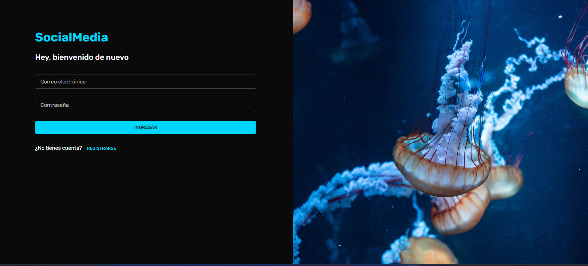
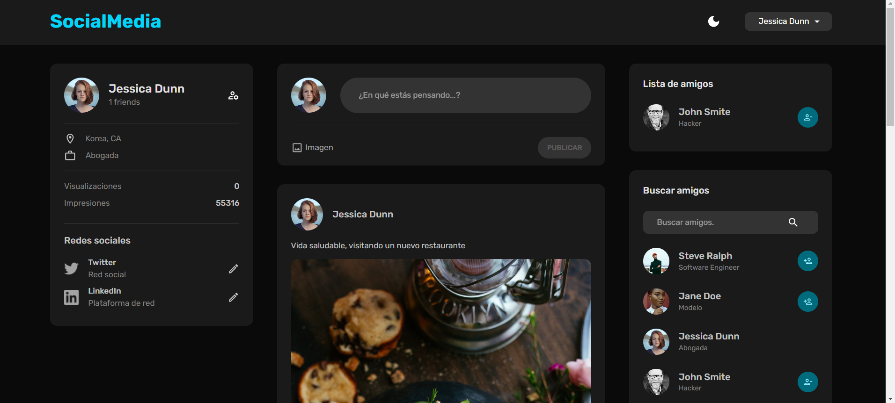
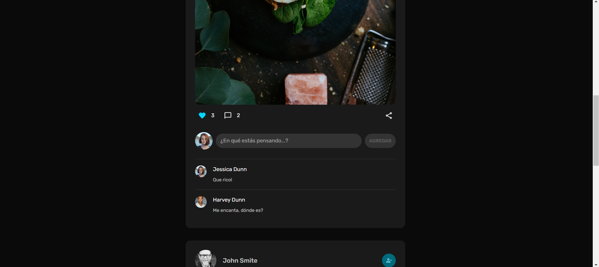
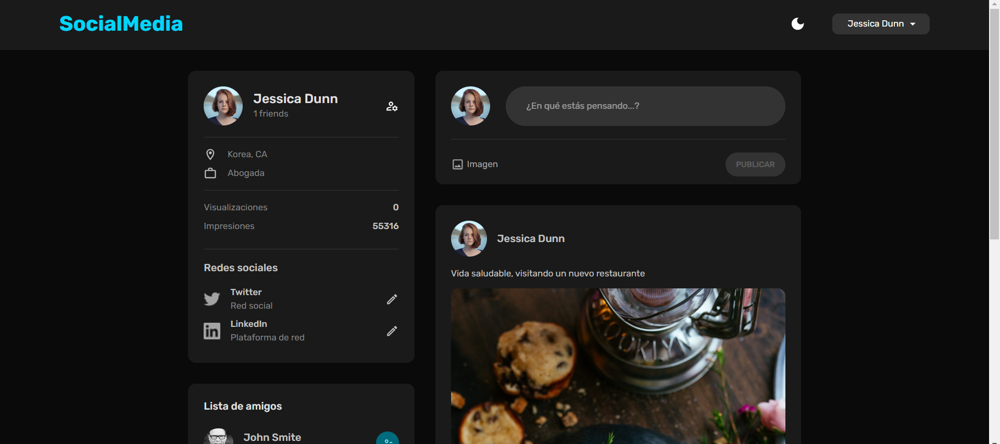
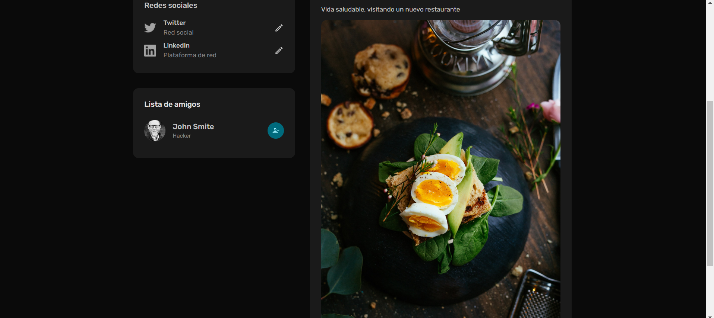
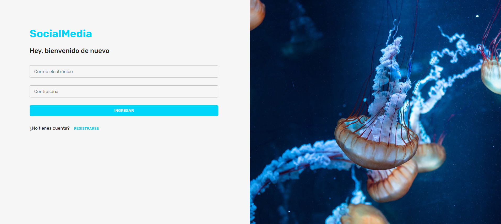
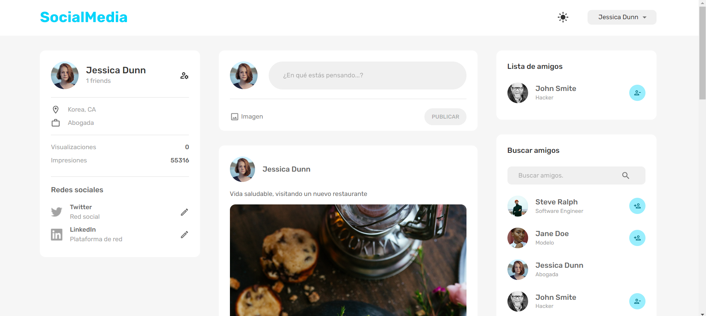
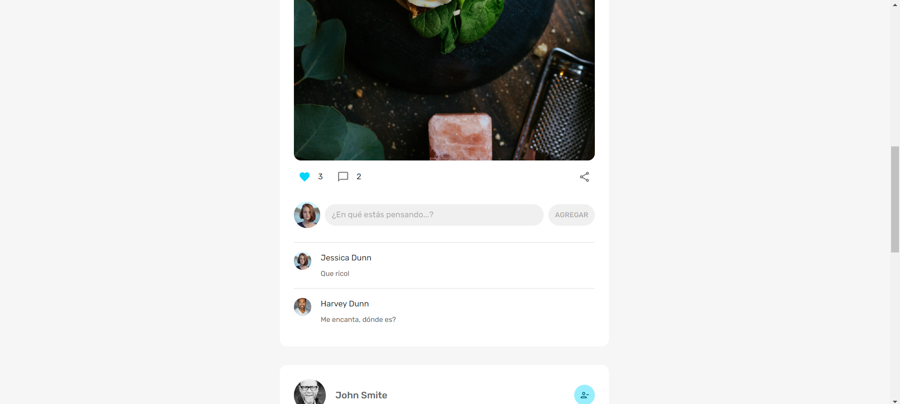
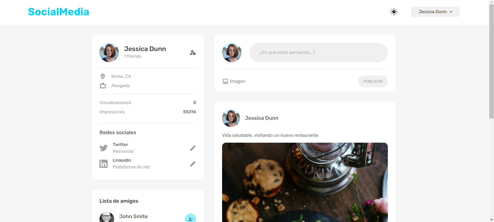

# **SOCIAL MEDIA APP WEB 🚀**

## **📌 DESCRIPCIÓN DEL PROYECTO**

¡Bienvenido a mi aplicación de redes sociales! Esta aplicación te permite conectarte con tus amigos y compartir tus momentos favoritos. Con una interfaz fácil de usar y características emocionantes, ¡explora un nuevo mundo social con SocialMedia!

En este proyecto podrás:
<br />
<br />
✅ Registrarte o iniciar sesión para acceder a tu cuenta personalizada.
<br />
✅ Ver las publicaciones de tus amigos y mantenerte al día con sus actividades.
<br />
✅ Añadir nuevos amigos para expandir tu círculo social.
<br />
✅ Eliminar amigos que ya no deseas seguir.
<br />
✅ Dar me gusta a las publicaciones.
<br />
✅ Añadir comentarios a tus publicaciones y a las de tus amigos.
<br />
✅ Buscar nuevos amigos para ampliar tu red.
<br />
✅ Ver el perfil de otros usuarios para conocer más sobre ellos.
<br />
✅ Disfrutar de un diseño responsive que se adapta a cualquier dispositivo.
<br />
✅ Cambiar entre modos claro y oscuro para una experiencia visual personalizada.

<br />
¡Únete a la comunidad y comienza a socializar hoy mismo!

<br />

## **🦾 TECNOLOGÍAS**

Este proyecto está construido utilizando las siguientes tecnologías:

- **JavaScript**, **HTML**, **CSS**, **React**, **Redux Toolkit**, **Node**, **Express**, **Mongoose**, **MongoDB**, **Material UI**

<br />

## **🧑 CREDENCIALES DE USUARIOS EXISTENTES**

A continuación, te proporciono las credenciales de usuarios existentes para que puedas acceder fácilmente:

```
USUARIO 1:

   email: jessica@test.com
   password: 123456

USUARIO 2:

   email: john@test.com
   password: 123456
```

<br />

## **📍 VISTAS MODO OSCURO**

**📍 LOGIN PAGE**



**📍 REGISTER PAGE**


**📍 HOME PAGE**





**📍 PROFILE PAGE**





## **📍 VISTAS MODO CLARO**

**📍 LOGIN PAGE**



**📍 REGISTER PAGE**


**📍 HOME PAGE**





**📍 PROFILE PAGE**




<br />

## **⚠️ REQUISITOS PARA INSTALAR LOCALMENTE**

1. Crea un archivo .env en la carpeta server.
2. Agrega las siguientes variables de entorno en el archivo .env, incluyendo la URL de la base de datos MongoDB:

   ```
    MONGO_URL=''
    JWT_SECRET='secret-jwt-social-media'
    PORT=3001
   ```

<br />

**⚠️ INSTALACIÓN**

Utiliza npm para instalar las dependencias necesarias. Ejecuta este comando dentro de las carpetas client y server:

`npm i`

**⚠️ EJECUCIÓN LOCAL**

Para ejecutar la aplicación localmente, sigue estos pasos:

- Backend -> dentro de ./server

`npm run start`

Observaciones: Por favor, verifica en la consola de la terminal que aparezca el siguiente mensaje: "Initial data added successfully." Esto te permitirá confirmar que la carga inicial de datos se ha realizado correctamente.

- Frontend -> dentro de ./cliente

`npm run dev`

<br />
